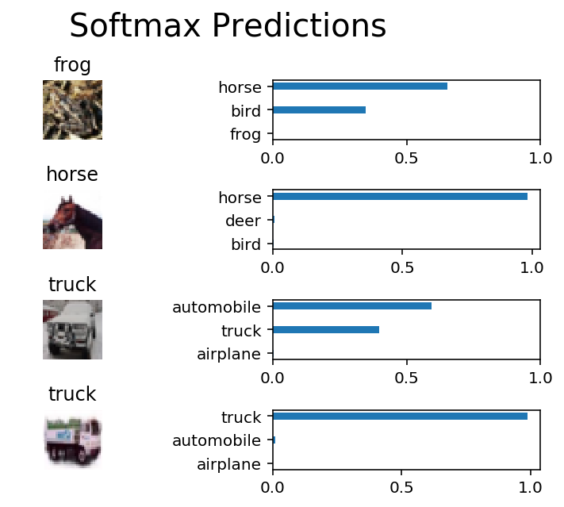

# 图像分类

此项目，将对[CIFAR-10 数据集](https://www.cs.toronto.edu/~kriz/cifar.html) 中的图片进行分类。
该数据集包含飞机、猫狗和其他物体。导入数据后，需要预处理这些图片，然后用所有样本训练一个卷积神经网络。图片需要标准化（normalized），标签需要采用 one-hot 编码。


## 获取数据

运行以下单元，以下载 [CIFAR-10 数据集（Python版）](https://www.cs.toronto.edu/~kriz/cifar-10-python.tar.gz)。


```python
"""
DON'T MODIFY ANYTHING IN THIS CELL THAT IS BELOW THIS LINE
"""
from urllib.request import urlretrieve
from os.path import isfile, isdir
from tqdm import tqdm
import problem_unittests as tests
import tarfile

cifar10_dataset_folder_path = 'cifar-10-batches-py'

# Use Floyd's cifar-10 dataset if present
floyd_cifar10_location = '/input/cifar-10/python.tar.gz'
if isfile(floyd_cifar10_location):
    tar_gz_path = floyd_cifar10_location
else:
    tar_gz_path = 'cifar-10-python.tar.gz'

class DLProgress(tqdm):
    last_block = 0

    def hook(self, block_num=1, block_size=1, total_size=None):
        self.total = total_size
        self.update((block_num - self.last_block) * block_size)
        self.last_block = block_num

if not isfile(tar_gz_path):
    with DLProgress(unit='B', unit_scale=True, miniters=1, desc='CIFAR-10 Dataset') as pbar:
        urlretrieve(
            'https://www.cs.toronto.edu/~kriz/cifar-10-python.tar.gz',
            tar_gz_path,
            pbar.hook)

if not isdir(cifar10_dataset_folder_path):
    with tarfile.open(tar_gz_path) as tar:
        tar.extractall()
        tar.close()


tests.test_folder_path(cifar10_dataset_folder_path)
```

    All files found!
    

## 探索数据

该数据集分成了几部分／批次（batches），以免机器在计算时内存不足。CIFAR-10 数据集包含 5 个部分，名称分别为 `data_batch_1`、`data_batch_2`、`data_batch_3`、`data_batch_4`、`data_batch_5`。每个部分都包含以下某个类别的标签和图片：

* 飞机
* 汽车
* 鸟类
* 猫
* 鹿
* 狗
* 青蛙
* 马
* 船只
* 卡车

了解数据集也是对数据进行预测的必经步骤。可以通过更改 `batch_id` 和 `sample_id` 探索下面的代码单元。`batch_id` 是数据集一个部分的 ID（1 到 5）。`sample_id` 是该部分中图片和标签对（label pair）的 ID。


```python
%matplotlib inline
%config InlineBackend.figure_format = 'retina'

import helper
import numpy as np

# Explore the dataset
batch_id = 1
sample_id = 5
helper.display_stats(cifar10_dataset_folder_path, batch_id, sample_id)
```

    
    Stats of batch 1:
    Samples: 10000
    Label Counts: {0: 1005, 1: 974, 2: 1032, 3: 1016, 4: 999, 5: 937, 6: 1030, 7: 1001, 8: 1025, 9: 981}
    First 20 Labels: [6, 9, 9, 4, 1, 1, 2, 7, 8, 3, 4, 7, 7, 2, 9, 9, 9, 3, 2, 6]
    
    Example of Image 5:
    Image - Min Value: 0 Max Value: 252
    Image - Shape: (32, 32, 3)
    Label - Label Id: 1 Name: automobile
    


## 实现预处理函数

### 标准化

在下面的单元中，实现 `normalize` 函数，传入图片数据 `x`，并返回标准化 Numpy 数组。值应该在 0 到 1 的范围内（含 0 和 1）。返回对象应该和 `x` 的形状一样。


```python
def normalize(x):
    """
    Normalize a list of sample image data in the range of 0 to 1
    : x: List of image data.  The image shape is (32, 32, 3)
    : return: Numpy array of normalize data
    """
    # TODO: Implement Function
    xmax,xmin = x.max(),x.min()
    return (x - xmin)/(xmax - xmin)


"""
DON'T MODIFY ANYTHING IN THIS CELL THAT IS BELOW THIS LINE
"""
tests.test_normalize(normalize)
```

    Tests Passed
    

### One-hot 编码

实现 `one_hot_encode` 函数， `x`，是一个标签列表。实现该函数，以返回为 one_hot 编码的 Numpy 数组的标签列表。标签的可能值为 0 到 9。每次调用 `one_hot_encode` 时，对于每个值，one_hot 编码函数应该返回相同的编码。确保将编码映射保存到该函数外面。


```python
def one_hot_encode(x):
    """
    One hot encode a list of sample labels. Return a one-hot encoded vector for each label.
    : x: List of sample Labels
    : return: Numpy array of one-hot encoded labels
    """
    # TODO: Implement Function
    return np.eye(10)[x]
    

"""
DON'T MODIFY ANYTHING IN THIS CELL THAT IS BELOW THIS LINE
"""
tests.test_one_hot_encode(one_hot_encode)
```

    Tests Passed
    

## 预处理所有数据并保存

运行下方的代码单元，将预处理所有 CIFAR-10 数据，并保存到文件中。下面的代码还使用了 10% 的训练数据，用来验证。


```python
"""
DON'T MODIFY ANYTHING IN THIS CELL
"""
# Preprocess Training, Validation, and Testing Data
helper.preprocess_and_save_data(cifar10_dataset_folder_path, normalize, one_hot_encode)
```

# 检查点

这是第一个检查点。如果需要重新启动该记事本，可以从这里开始。预处理的数据已保存到本地。


```python
"""
DON'T MODIFY ANYTHING IN THIS CELL
"""
import pickle
import problem_unittests as tests
import helper

# Load the Preprocessed Validation data
valid_features, valid_labels = pickle.load(open('preprocess_validation.p', mode='rb'))
```

## 构建网络

对于该神经网络，需要将每层都构建为一个函数。


### 输入

神经网络需要读取图片数据、one-hot 编码标签和丢弃保留概率（dropout keep probability）。需要实现的函数：

* 实现 `neural_net_image_input`
 * 返回 [TF Placeholder](https://www.tensorflow.org/api_docs/python/tf/placeholder)
 * 使用 `image_shape` 设置形状，部分大小设为 `None`
 * 使用 [TF Placeholder](https://www.tensorflow.org/api_docs/python/tf/placeholder) 中的 TensorFlow `name` 参数对 TensorFlow 占位符 "x" 命名
* 实现 `neural_net_label_input`
 * 返回 [TF Placeholder](https://www.tensorflow.org/api_docs/python/tf/placeholder)
 * 使用 `n_classes` 设置形状，部分大小设为 `None`
 * 使用 [TF Placeholder](https://www.tensorflow.org/api_docs/python/tf/placeholder) 中的 TensorFlow `name` 参数对 TensorFlow 占位符 "y" 命名
* 实现 `neural_net_keep_prob_input`
 * 返回 [TF Placeholder](https://www.tensorflow.org/api_docs/python/tf/placeholder)，用于丢弃保留概率
 * 使用 [TF Placeholder](https://www.tensorflow.org/api_docs/python/tf/placeholder) 中的 TensorFlow `name` 参数对 TensorFlow 占位符 "keep_prob" 命名

这些名称将在项目结束时，用于加载保存的模型。

注意：TensorFlow 中的 `None` 表示形状可以是动态大小。


```python
import tensorflow as tf

def neural_net_image_input(image_shape):
    """
    Return a Tensor for a batch of image input
    : image_shape: Shape of the images
    : return: Tensor for image input.
    """
    # TODO: Implement Function
    x = tf.placeholder(tf.float32, [None, image_shape[0], image_shape[1], image_shape[2]],name='x')
    return x


def neural_net_label_input(n_classes):
    """
    Return a Tensor for a batch of label input
    : n_classes: Number of classes
    : return: Tensor for label input.
    """
    # TODO: Implement Function
    y = tf.placeholder(tf.float32, [None, n_classes],name='y')
    return y


def neural_net_keep_prob_input():
    """
    Return a Tensor for keep probability
    : return: Tensor for keep probability.
    """
    # TODO: Implement Function
    keep_prob = tf.placeholder(tf.float32,name='keep_prob')
    return keep_prob

"""
DON'T MODIFY ANYTHING IN THIS CELL THAT IS BELOW THIS LINE
"""
tf.reset_default_graph()
tests.test_nn_image_inputs(neural_net_image_input)
tests.test_nn_label_inputs(neural_net_label_input)
tests.test_nn_keep_prob_inputs(neural_net_keep_prob_input)
```

    Image Input Tests Passed.
    Label Input Tests Passed.
    Keep Prob Tests Passed.
    

### 卷积和最大池化层

卷积层级适合处理图片。对于此代码单元，应该实现函数 `conv2d_maxpool` 以便应用卷积然后进行最大池化：

* 使用 `conv_ksize`、`conv_num_outputs` 和 `x_tensor` 的形状创建权重（weight）和偏置（bias）。
* 使用权重和 `conv_strides` 对 `x_tensor` 应用卷积。
 * 建议使用我们建议的间距（padding），当然也可以使用任何其他间距。
* 添加偏置
* 向卷积中添加非线性激活（nonlinear activation）
* 使用 `pool_ksize` 和 `pool_strides` 应用最大池化
 


```python
def conv2d_maxpool(x_tensor, conv_num_outputs, conv_ksize, conv_strides, pool_ksize, pool_strides):
    """
    Apply convolution then max pooling to x_tensor
    :param x_tensor: TensorFlow Tensor
    :param conv_num_outputs: Number of outputs for the convolutional layer
    :param conv_ksize: kernal size 2-D Tuple for the convolutional layer
    :param conv_strides: Stride 2-D Tuple for convolution
    :param pool_ksize: kernal size 2-D Tuple for pool
    :param pool_strides: Stride 2-D Tuple for pool
    : return: A tensor that represents convolution and max pooling of x_tensor
    """
    # TODO: Implement Function
    weight = tf.Variable(tf.random_normal([conv_ksize[0], conv_ksize[1], x_tensor.get_shape().as_list()[-1], conv_num_outputs], stddev=5e-2))
    bias = tf.Variable(tf.zeros(conv_num_outputs))

    conv_layer = tf.nn.conv2d(x_tensor, weight, strides=[1, conv_strides[0], conv_strides[1], 1], padding='SAME')
    conv_layer = tf.nn.bias_add(conv_layer, bias)
    conv_layer = tf.nn.relu(conv_layer)

    conv_layer = tf.nn.max_pool(conv_layer, ksize=[1, pool_ksize[0], pool_ksize[1], 1], strides=[1,pool_strides[0],pool_strides[1],1], padding='SAME')
    return conv_layer


"""
DON'T MODIFY ANYTHING IN THIS CELL THAT IS BELOW THIS LINE
"""
tests.test_con_pool(conv2d_maxpool)
```

    Tests Passed
    

### 扁平化层

实现 `flatten` 函数，将 `x_tensor` 的维度从四维张量（4-D tensor）变成二维张量。输出应该是形状（*部分大小（Batch Size）*，*扁平化图片大小（Flattened Image Size）*）。


```python
def flatten(x_tensor):
    """
    Flatten x_tensor to (Batch Size, Flattened Image Size)
    : x_tensor: A tensor of size (Batch Size, ...), where ... are the image dimensions.
    : return: A tensor of size (Batch Size, Flattened Image Size).
    """
    # TODO: Implement Function
    w1 = x_tensor.get_shape().as_list()[1]
    h1 = x_tensor.get_shape().as_list()[2]
    d1 = x_tensor.get_shape().as_list()[3]
    x_flat = tf.reshape(x_tensor,[-1, w1 * h1 *d1])
    return x_flat


"""
DON'T MODIFY ANYTHING IN THIS CELL THAT IS BELOW THIS LINE
"""
tests.test_flatten(flatten)
```

    Tests Passed
    

### 全连接层

实现 `fully_conn` 函数，以向 `x_tensor` 应用完全连接的层级，形状为（*部分大小（Batch Size）*，*num_outputs*）。


```python
def fully_conn(x_tensor, num_outputs):
    """
    Apply a fully connected layer to x_tensor using weight and bias
    : x_tensor: A 2-D tensor where the first dimension is batch size.
    : num_outputs: The number of output that the new tensor should be.
    : return: A 2-D tensor where the second dimension is num_outputs.
    """
    # TODO: Implement Function
    return tf.contrib.layers.fully_connected(x_tensor, num_outputs)


"""
DON'T MODIFY ANYTHING IN THIS CELL THAT IS BELOW THIS LINE
"""
tests.test_fully_conn(fully_conn)
```

    Tests Passed
    

### 输出层

实现 `output` 函数，向 x_tensor 应用完全连接的层级，形状为（*部分大小（Batch Size）*，*num_outputs*）。

**注意**：该层级不应应用 Activation、softmax 或交叉熵（cross entropy）。


```python
def output(x_tensor, num_outputs):
    """
    Apply a output layer to x_tensor using weight and bias
    : x_tensor: A 2-D tensor where the first dimension is batch size.
    : num_outputs: The number of output that the new tensor should be.
    : return: A 2-D tensor where the second dimension is num_outputs.
    """
    # TODO: Implement Function
    return tf.contrib.layers.legacy_fully_connected(x_tensor, num_outputs)


"""
DON'T MODIFY ANYTHING IN THIS CELL THAT IS BELOW THIS LINE
"""
tests.test_output(output)
```

    Tests Passed
    

### 创建卷积模型

实现函数 `conv_net`， 创建卷积神经网络模型。该函数传入一批图片 `x`，并输出对数（logits）。使用上方创建的层创建此模型：

* 应用 1、2 或 3 个卷积和最大池化层（Convolution and Max Pool layers）
* 应用一个扁平层（Flatten Layer）
* 应用 1、2 或 3 个完全连接层（Fully Connected Layers）
* 应用一个输出层（Output Layer）
* 返回输出
* 使用 `keep_prob` 向模型中的一个或多个层应用 [TensorFlow 的 Dropout](https://www.tensorflow.org/api_docs/python/tf/nn/dropout)


```python
def conv_net(x, keep_prob):
    """
    Create a convolutional neural network model
    : x: Placeholder tensor that holds image data.
    : keep_prob: Placeholder tensor that hold dropout keep probability.
    : return: Tensor that represents logits
    """
    # TODO: Apply 1, 2, or 3 Convolution and Max Pool layers
    #    Play around with different number of outputs, kernel size and stride
    # Function Definition from Above:
    #    conv2d_maxpool(x_tensor, conv_num_outputs, conv_ksize, conv_strides, pool_ksize, pool_strides)
    conv_num_outputs = 64
    conv_ksize = (3, 3)
    conv_strides = (1, 1)
    pool_ksize = (2, 2)
    pool_strides = (2, 2)
    conv1 = conv2d_maxpool(x, conv_num_outputs, conv_ksize, conv_strides, pool_ksize, pool_strides)

    # TODO: Apply a Flatten Layer
    # Function Definition from Above:
    #   flatten(x_tensor)
    fc1 =  flatten(conv1)

    # TODO: Apply 1, 2, or 3 Fully Connected Layers
    #    Play around with different number of outputs
    # Function Definition from Above:
    #   fully_conn(x_tensor, num_outputs)
    fc2 = fully_conn(fc1, 192)
    fc3 = tf.nn.dropout(fc2, keep_prob)

    # TODO: Apply an Output Layer
    #    Set this to the number of classes
    # Function Definition from Above:
    #   output(x_tensor, num_outputs)
    
    out = output(fc3, 10)
    # TODO: return output
    return out


"""
DON'T MODIFY ANYTHING IN THIS CELL THAT IS BELOW THIS LINE
"""

##############################
## Build the Neural Network ##
##############################

# Remove previous weights, bias, inputs, etc..
tf.reset_default_graph()

# Inputs
x = neural_net_image_input((32, 32, 3))
y = neural_net_label_input(10)
keep_prob = neural_net_keep_prob_input()

# Model
logits = conv_net(x, keep_prob)

# Name logits Tensor, so that is can be loaded from disk after training
logits = tf.identity(logits, name='logits')

# Loss and Optimizer
cost = tf.reduce_mean(tf.nn.softmax_cross_entropy_with_logits(logits=logits, labels=y))
optimizer = tf.train.AdamOptimizer().minimize(cost)

# Accuracy
correct_pred = tf.equal(tf.argmax(logits, 1), tf.argmax(y, 1))
accuracy = tf.reduce_mean(tf.cast(correct_pred, tf.float32), name='accuracy')

tests.test_conv_net(conv_net)
```

    Neural Network Built!
    

## 训练神经网络

### 单次优化

实现函数 `train_neural_network` 以进行单次优化（single optimization）。该优化应该使用 `optimizer` 优化 `session`，其中 `feed_dict` 具有以下参数：

* `x` 表示图片输入
* `y` 表示标签
* `keep_prob` 表示丢弃的保留率

每个部分都会调用该函数，所以 `tf.global_variables_initializer()` 已经被调用。

注意：不需要返回任何内容。该函数只是用来优化神经网络。


```python
def train_neural_network(session, optimizer, keep_probability, feature_batch, label_batch):
    """
    Optimize the session on a batch of images and labels
    : session: Current TensorFlow session
    : optimizer: TensorFlow optimizer function
    : keep_probability: keep probability
    : feature_batch: Batch of Numpy image data
    : label_batch: Batch of Numpy label data
    """
    # TODO: Implement Function
    session.run(optimizer, feed_dict={
                x: feature_batch,
                y: label_batch,
                keep_prob: keep_probability})


"""
DON'T MODIFY ANYTHING IN THIS CELL THAT IS BELOW THIS LINE
"""
tests.test_train_nn(train_neural_network)
```

    Tests Passed
    

### 显示数据

实现函数 `print_stats` 以输出损失和验证准确率。使用全局变量 `valid_features` 和 `valid_labels` 计算验证准确率。使用保留率 `1.0` 计算损失和验证准确率（loss and validation accuracy）。


```python
def print_stats(session, feature_batch, label_batch, cost, accuracy):
    """
    Print information about loss and validation accuracy
    : session: Current TensorFlow session
    : feature_batch: Batch of Numpy image data
    : label_batch: Batch of Numpy label data
    : cost: TensorFlow cost function
    : accuracy: TensorFlow accuracy function
    """
    # TODO: Implement Function
    loss = session.run(cost, feed_dict={
                x: feature_batch,
                y: label_batch,
                keep_prob: 1.})
    valid_acc = session.run(accuracy, feed_dict={
                x: valid_features,
                y: valid_labels,
                keep_prob: 1.})

    print('loss: {:>10.4f}, Validation Accuracy: {:.6f}'.format(loss,valid_acc))
```

### 超参数

调试以下超参数：
* 设置 `epochs` 表示神经网络停止学习或开始过拟合的迭代次数
* 设置 `batch_size`，表示机器内存允许的部分最大体积。大部分人设为以下常见内存大小：

 * 64
 * 128
 * 256
 * ...
* 设置 `keep_probability` 表示使用丢弃时保留节点的概率


```python
# TODO: Tune Parameters
epochs = 50
batch_size = 128
keep_probability = 0.5
```

### 在单个 CIFAR-10 部分上训练

先用单个部分，而不是用所有的 CIFAR-10 批次训练神经网络。这样可以节省时间，并对模型进行迭代，以提高准确率。最终验证准确率达到 50% 或以上之后，在下一部分对所有数据运行模型。


```python
"""
DON'T MODIFY ANYTHING IN THIS CELL
"""
print('Checking the Training on a Single Batch...')
with tf.Session() as sess:
    # Initializing the variables
    sess.run(tf.global_variables_initializer())
    
    # Training cycle
    for epoch in range(epochs):
        batch_i = 1
        for batch_features, batch_labels in helper.load_preprocess_training_batch(batch_i, batch_size):
            train_neural_network(sess, optimizer, keep_probability, batch_features, batch_labels)
        print('Epoch {:>2}, CIFAR-10 Batch {}:  '.format(epoch + 1, batch_i), end='')
        print_stats(sess, batch_features, batch_labels, cost, accuracy)
```

    Checking the Training on a Single Batch...
    Epoch  1, CIFAR-10 Batch 1:  loss:     1.9073, Validation Accuracy: 0.395600
    Epoch  2, CIFAR-10 Batch 1:  loss:     1.7249, Validation Accuracy: 0.452000
    Epoch  3, CIFAR-10 Batch 1:  loss:     1.5303, Validation Accuracy: 0.480600
    Epoch  4, CIFAR-10 Batch 1:  loss:     1.2854, Validation Accuracy: 0.503600
    Epoch  5, CIFAR-10 Batch 1:  loss:     1.1951, Validation Accuracy: 0.515200
    Epoch  6, CIFAR-10 Batch 1:  loss:     1.0568, Validation Accuracy: 0.517800
    Epoch  7, CIFAR-10 Batch 1:  loss:     0.8888, Validation Accuracy: 0.537600
    Epoch  8, CIFAR-10 Batch 1:  loss:     0.8458, Validation Accuracy: 0.537200
    Epoch  9, CIFAR-10 Batch 1:  loss:     0.7409, Validation Accuracy: 0.533800
    Epoch 10, CIFAR-10 Batch 1:  loss:     0.7196, Validation Accuracy: 0.531600
    Epoch 11, CIFAR-10 Batch 1:  loss:     0.6203, Validation Accuracy: 0.553400
    Epoch 12, CIFAR-10 Batch 1:  loss:     0.5870, Validation Accuracy: 0.553400
    Epoch 13, CIFAR-10 Batch 1:  loss:     0.5545, Validation Accuracy: 0.561000
    Epoch 14, CIFAR-10 Batch 1:  loss:     0.5017, Validation Accuracy: 0.565200
    Epoch 15, CIFAR-10 Batch 1:  loss:     0.4217, Validation Accuracy: 0.558200
    Epoch 16, CIFAR-10 Batch 1:  loss:     0.3817, Validation Accuracy: 0.566000
    Epoch 17, CIFAR-10 Batch 1:  loss:     0.3448, Validation Accuracy: 0.568800
    Epoch 18, CIFAR-10 Batch 1:  loss:     0.3232, Validation Accuracy: 0.569600
    Epoch 19, CIFAR-10 Batch 1:  loss:     0.2981, Validation Accuracy: 0.544800
    Epoch 20, CIFAR-10 Batch 1:  loss:     0.2615, Validation Accuracy: 0.563000
    Epoch 21, CIFAR-10 Batch 1:  loss:     0.2639, Validation Accuracy: 0.557600
    Epoch 22, CIFAR-10 Batch 1:  loss:     0.2129, Validation Accuracy: 0.563800
    Epoch 23, CIFAR-10 Batch 1:  loss:     0.1886, Validation Accuracy: 0.574200
    Epoch 24, CIFAR-10 Batch 1:  loss:     0.1461, Validation Accuracy: 0.572000
    Epoch 25, CIFAR-10 Batch 1:  loss:     0.1638, Validation Accuracy: 0.570200
    Epoch 26, CIFAR-10 Batch 1:  loss:     0.1554, Validation Accuracy: 0.576000
    Epoch 27, CIFAR-10 Batch 1:  loss:     0.1254, Validation Accuracy: 0.565600
    Epoch 28, CIFAR-10 Batch 1:  loss:     0.1122, Validation Accuracy: 0.565400
    Epoch 29, CIFAR-10 Batch 1:  loss:     0.0883, Validation Accuracy: 0.568200
    Epoch 30, CIFAR-10 Batch 1:  loss:     0.0809, Validation Accuracy: 0.569600
    Epoch 31, CIFAR-10 Batch 1:  loss:     0.0832, Validation Accuracy: 0.574400
    Epoch 32, CIFAR-10 Batch 1:  loss:     0.0846, Validation Accuracy: 0.558600
    Epoch 33, CIFAR-10 Batch 1:  loss:     0.0812, Validation Accuracy: 0.562200
    Epoch 34, CIFAR-10 Batch 1:  loss:     0.0748, Validation Accuracy: 0.561800
    Epoch 35, CIFAR-10 Batch 1:  loss:     0.0644, Validation Accuracy: 0.567800
    Epoch 36, CIFAR-10 Batch 1:  loss:     0.0516, Validation Accuracy: 0.562000
    Epoch 37, CIFAR-10 Batch 1:  loss:     0.0677, Validation Accuracy: 0.562800
    Epoch 38, CIFAR-10 Batch 1:  loss:     0.0435, Validation Accuracy: 0.564000
    Epoch 39, CIFAR-10 Batch 1:  loss:     0.0538, Validation Accuracy: 0.559200
    Epoch 40, CIFAR-10 Batch 1:  loss:     0.0491, Validation Accuracy: 0.563600
    Epoch 41, CIFAR-10 Batch 1:  loss:     0.0513, Validation Accuracy: 0.564600
    Epoch 42, CIFAR-10 Batch 1:  loss:     0.0471, Validation Accuracy: 0.561600
    Epoch 43, CIFAR-10 Batch 1:  loss:     0.0617, Validation Accuracy: 0.566600
    Epoch 44, CIFAR-10 Batch 1:  loss:     0.0399, Validation Accuracy: 0.561800
    Epoch 45, CIFAR-10 Batch 1:  loss:     0.0358, Validation Accuracy: 0.564200
    Epoch 46, CIFAR-10 Batch 1:  loss:     0.0354, Validation Accuracy: 0.558400
    Epoch 47, CIFAR-10 Batch 1:  loss:     0.0347, Validation Accuracy: 0.557000
    Epoch 48, CIFAR-10 Batch 1:  loss:     0.0209, Validation Accuracy: 0.573000
    Epoch 49, CIFAR-10 Batch 1:  loss:     0.0256, Validation Accuracy: 0.566800
    Epoch 50, CIFAR-10 Batch 1:  loss:     0.0197, Validation Accuracy: 0.562600
    

### 完全训练模型


```python
"""
DON'T MODIFY ANYTHING IN THIS CELL
"""
save_model_path = './image_classification'

print('Training...')
with tf.Session() as sess:
    # Initializing the variables
    sess.run(tf.global_variables_initializer())
    
    # Training cycle
    for epoch in range(epochs):
        # Loop over all batches
        n_batches = 5
        for batch_i in range(1, n_batches + 1):
            for batch_features, batch_labels in helper.load_preprocess_training_batch(batch_i, batch_size):
                train_neural_network(sess, optimizer, keep_probability, batch_features, batch_labels)
            print('Epoch {:>2}, CIFAR-10 Batch {}:  '.format(epoch + 1, batch_i), end='')
            print_stats(sess, batch_features, batch_labels, cost, accuracy)
            
    # Save Model
    saver = tf.train.Saver()
    save_path = saver.save(sess, save_model_path)
```

    Training...
    Epoch  1, CIFAR-10 Batch 1:  loss:     2.0538, Validation Accuracy: 0.348800
    Epoch  1, CIFAR-10 Batch 2:  loss:     1.6861, Validation Accuracy: 0.426200
    Epoch  1, CIFAR-10 Batch 3:  loss:     1.4966, Validation Accuracy: 0.458600
    Epoch  1, CIFAR-10 Batch 4:  loss:     1.5010, Validation Accuracy: 0.479800
    Epoch  1, CIFAR-10 Batch 5:  loss:     1.5355, Validation Accuracy: 0.502400
    Epoch  2, CIFAR-10 Batch 1:  loss:     1.6391, Validation Accuracy: 0.495400
    Epoch  2, CIFAR-10 Batch 2:  loss:     1.2858, Validation Accuracy: 0.521200
    Epoch  2, CIFAR-10 Batch 3:  loss:     1.2167, Validation Accuracy: 0.512000
    Epoch  2, CIFAR-10 Batch 4:  loss:     1.3681, Validation Accuracy: 0.526800
    Epoch  2, CIFAR-10 Batch 5:  loss:     1.3652, Validation Accuracy: 0.530000
    Epoch  3, CIFAR-10 Batch 1:  loss:     1.3644, Validation Accuracy: 0.548800
    Epoch  3, CIFAR-10 Batch 2:  loss:     1.1626, Validation Accuracy: 0.533600
    Epoch  3, CIFAR-10 Batch 3:  loss:     1.0495, Validation Accuracy: 0.548600
    Epoch  3, CIFAR-10 Batch 4:  loss:     1.2273, Validation Accuracy: 0.565600
    Epoch  3, CIFAR-10 Batch 5:  loss:     1.2422, Validation Accuracy: 0.537000
    Epoch  4, CIFAR-10 Batch 1:  loss:     1.1809, Validation Accuracy: 0.560200
    Epoch  4, CIFAR-10 Batch 2:  loss:     1.0332, Validation Accuracy: 0.572800
    Epoch  4, CIFAR-10 Batch 3:  loss:     0.9133, Validation Accuracy: 0.553200
    Epoch  4, CIFAR-10 Batch 4:  loss:     1.1253, Validation Accuracy: 0.577400
    Epoch  4, CIFAR-10 Batch 5:  loss:     1.0730, Validation Accuracy: 0.579200
    Epoch  5, CIFAR-10 Batch 1:  loss:     1.1679, Validation Accuracy: 0.576400
    Epoch  5, CIFAR-10 Batch 2:  loss:     0.9422, Validation Accuracy: 0.569800
    Epoch  5, CIFAR-10 Batch 3:  loss:     0.8542, Validation Accuracy: 0.572000
    Epoch  5, CIFAR-10 Batch 4:  loss:     0.9886, Validation Accuracy: 0.589400
    Epoch  5, CIFAR-10 Batch 5:  loss:     0.9743, Validation Accuracy: 0.584000
    Epoch  6, CIFAR-10 Batch 1:  loss:     1.0241, Validation Accuracy: 0.590400
    Epoch  6, CIFAR-10 Batch 2:  loss:     0.8794, Validation Accuracy: 0.588000
    Epoch  6, CIFAR-10 Batch 3:  loss:     0.7603, Validation Accuracy: 0.594600
    Epoch  6, CIFAR-10 Batch 4:  loss:     0.9298, Validation Accuracy: 0.596600
    Epoch  6, CIFAR-10 Batch 5:  loss:     0.9312, Validation Accuracy: 0.592200
    Epoch  7, CIFAR-10 Batch 1:  loss:     0.9722, Validation Accuracy: 0.594000
    Epoch  7, CIFAR-10 Batch 2:  loss:     0.7979, Validation Accuracy: 0.600400
    Epoch  7, CIFAR-10 Batch 3:  loss:     0.7425, Validation Accuracy: 0.605600
    Epoch  7, CIFAR-10 Batch 4:  loss:     0.8449, Validation Accuracy: 0.610800
    Epoch  7, CIFAR-10 Batch 5:  loss:     0.8481, Validation Accuracy: 0.611400
    Epoch  8, CIFAR-10 Batch 1:  loss:     0.9369, Validation Accuracy: 0.612200
    Epoch  8, CIFAR-10 Batch 2:  loss:     0.7735, Validation Accuracy: 0.610400
    Epoch  8, CIFAR-10 Batch 3:  loss:     0.6896, Validation Accuracy: 0.607800
    Epoch  8, CIFAR-10 Batch 4:  loss:     0.7247, Validation Accuracy: 0.612800
    Epoch  8, CIFAR-10 Batch 5:  loss:     0.7529, Validation Accuracy: 0.620400
    Epoch  9, CIFAR-10 Batch 1:  loss:     0.8154, Validation Accuracy: 0.625600
    Epoch  9, CIFAR-10 Batch 2:  loss:     0.7363, Validation Accuracy: 0.617600
    Epoch  9, CIFAR-10 Batch 3:  loss:     0.6879, Validation Accuracy: 0.596000
    Epoch  9, CIFAR-10 Batch 4:  loss:     0.7410, Validation Accuracy: 0.602800
    Epoch  9, CIFAR-10 Batch 5:  loss:     0.7141, Validation Accuracy: 0.622200
    Epoch 10, CIFAR-10 Batch 1:  loss:     0.8292, Validation Accuracy: 0.621400
    Epoch 10, CIFAR-10 Batch 2:  loss:     0.6549, Validation Accuracy: 0.628800
    Epoch 10, CIFAR-10 Batch 3:  loss:     0.5829, Validation Accuracy: 0.620600
    Epoch 10, CIFAR-10 Batch 4:  loss:     0.7098, Validation Accuracy: 0.607000
    Epoch 10, CIFAR-10 Batch 5:  loss:     0.7267, Validation Accuracy: 0.622400
    Epoch 11, CIFAR-10 Batch 1:  loss:     0.7545, Validation Accuracy: 0.626600
    Epoch 11, CIFAR-10 Batch 2:  loss:     0.6103, Validation Accuracy: 0.633600
    Epoch 11, CIFAR-10 Batch 3:  loss:     0.5614, Validation Accuracy: 0.619800
    Epoch 11, CIFAR-10 Batch 4:  loss:     0.5897, Validation Accuracy: 0.630800
    Epoch 11, CIFAR-10 Batch 5:  loss:     0.6363, Validation Accuracy: 0.623400
    Epoch 12, CIFAR-10 Batch 1:  loss:     0.6884, Validation Accuracy: 0.632200
    Epoch 12, CIFAR-10 Batch 2:  loss:     0.6170, Validation Accuracy: 0.627200
    Epoch 12, CIFAR-10 Batch 3:  loss:     0.5364, Validation Accuracy: 0.625400
    Epoch 12, CIFAR-10 Batch 4:  loss:     0.5357, Validation Accuracy: 0.621800
    Epoch 12, CIFAR-10 Batch 5:  loss:     0.5943, Validation Accuracy: 0.618800
    Epoch 13, CIFAR-10 Batch 1:  loss:     0.6429, Validation Accuracy: 0.629800
    Epoch 13, CIFAR-10 Batch 2:  loss:     0.5363, Validation Accuracy: 0.643800
    Epoch 13, CIFAR-10 Batch 3:  loss:     0.4698, Validation Accuracy: 0.634200
    Epoch 13, CIFAR-10 Batch 4:  loss:     0.5176, Validation Accuracy: 0.629000
    Epoch 13, CIFAR-10 Batch 5:  loss:     0.5593, Validation Accuracy: 0.638200
    Epoch 14, CIFAR-10 Batch 1:  loss:     0.6246, Validation Accuracy: 0.639800
    Epoch 14, CIFAR-10 Batch 2:  loss:     0.4753, Validation Accuracy: 0.640800
    Epoch 14, CIFAR-10 Batch 3:  loss:     0.4435, Validation Accuracy: 0.634600
    Epoch 14, CIFAR-10 Batch 4:  loss:     0.4810, Validation Accuracy: 0.631200
    Epoch 14, CIFAR-10 Batch 5:  loss:     0.4918, Validation Accuracy: 0.632600
    Epoch 15, CIFAR-10 Batch 1:  loss:     0.5871, Validation Accuracy: 0.639400
    Epoch 15, CIFAR-10 Batch 2:  loss:     0.4569, Validation Accuracy: 0.645000
    Epoch 15, CIFAR-10 Batch 3:  loss:     0.3989, Validation Accuracy: 0.646400
    Epoch 15, CIFAR-10 Batch 4:  loss:     0.4709, Validation Accuracy: 0.628600
    Epoch 15, CIFAR-10 Batch 5:  loss:     0.5277, Validation Accuracy: 0.639800
    Epoch 16, CIFAR-10 Batch 1:  loss:     0.5195, Validation Accuracy: 0.644200
    Epoch 16, CIFAR-10 Batch 2:  loss:     0.4452, Validation Accuracy: 0.647400
    Epoch 16, CIFAR-10 Batch 3:  loss:     0.3931, Validation Accuracy: 0.642200
    Epoch 16, CIFAR-10 Batch 4:  loss:     0.4523, Validation Accuracy: 0.633000
    Epoch 16, CIFAR-10 Batch 5:  loss:     0.4539, Validation Accuracy: 0.644400
    Epoch 17, CIFAR-10 Batch 1:  loss:     0.5045, Validation Accuracy: 0.630000
    Epoch 17, CIFAR-10 Batch 2:  loss:     0.4361, Validation Accuracy: 0.640400
    Epoch 17, CIFAR-10 Batch 3:  loss:     0.3767, Validation Accuracy: 0.638200
    Epoch 17, CIFAR-10 Batch 4:  loss:     0.4023, Validation Accuracy: 0.642200
    Epoch 17, CIFAR-10 Batch 5:  loss:     0.4313, Validation Accuracy: 0.638600
    Epoch 18, CIFAR-10 Batch 1:  loss:     0.4567, Validation Accuracy: 0.638600
    Epoch 18, CIFAR-10 Batch 2:  loss:     0.4133, Validation Accuracy: 0.642400
    Epoch 18, CIFAR-10 Batch 3:  loss:     0.3414, Validation Accuracy: 0.655200
    Epoch 18, CIFAR-10 Batch 4:  loss:     0.3895, Validation Accuracy: 0.633600
    Epoch 18, CIFAR-10 Batch 5:  loss:     0.3701, Validation Accuracy: 0.645800
    Epoch 19, CIFAR-10 Batch 1:  loss:     0.4446, Validation Accuracy: 0.643000
    Epoch 19, CIFAR-10 Batch 2:  loss:     0.4075, Validation Accuracy: 0.636200
    Epoch 19, CIFAR-10 Batch 3:  loss:     0.2996, Validation Accuracy: 0.646400
    Epoch 19, CIFAR-10 Batch 4:  loss:     0.3690, Validation Accuracy: 0.647400
    Epoch 19, CIFAR-10 Batch 5:  loss:     0.3504, Validation Accuracy: 0.649000
    Epoch 20, CIFAR-10 Batch 1:  loss:     0.4024, Validation Accuracy: 0.638200
    Epoch 20, CIFAR-10 Batch 2:  loss:     0.3702, Validation Accuracy: 0.650600
    Epoch 20, CIFAR-10 Batch 3:  loss:     0.3070, Validation Accuracy: 0.645400
    Epoch 20, CIFAR-10 Batch 4:  loss:     0.3622, Validation Accuracy: 0.636800
    Epoch 20, CIFAR-10 Batch 5:  loss:     0.3484, Validation Accuracy: 0.643800
    Epoch 21, CIFAR-10 Batch 1:  loss:     0.4266, Validation Accuracy: 0.648000
    Epoch 21, CIFAR-10 Batch 2:  loss:     0.3103, Validation Accuracy: 0.655000
    Epoch 21, CIFAR-10 Batch 3:  loss:     0.3029, Validation Accuracy: 0.656200
    Epoch 21, CIFAR-10 Batch 4:  loss:     0.3529, Validation Accuracy: 0.637200
    Epoch 21, CIFAR-10 Batch 5:  loss:     0.3240, Validation Accuracy: 0.648200
    Epoch 22, CIFAR-10 Batch 1:  loss:     0.4027, Validation Accuracy: 0.655400
    Epoch 22, CIFAR-10 Batch 2:  loss:     0.3100, Validation Accuracy: 0.653400
    Epoch 22, CIFAR-10 Batch 3:  loss:     0.2750, Validation Accuracy: 0.649400
    Epoch 22, CIFAR-10 Batch 4:  loss:     0.3330, Validation Accuracy: 0.636600
    Epoch 22, CIFAR-10 Batch 5:  loss:     0.3161, Validation Accuracy: 0.643000
    Epoch 23, CIFAR-10 Batch 1:  loss:     0.3567, Validation Accuracy: 0.642200
    Epoch 23, CIFAR-10 Batch 2:  loss:     0.3668, Validation Accuracy: 0.645600
    Epoch 23, CIFAR-10 Batch 3:  loss:     0.2577, Validation Accuracy: 0.652400
    Epoch 23, CIFAR-10 Batch 4:  loss:     0.3284, Validation Accuracy: 0.647800
    Epoch 23, CIFAR-10 Batch 5:  loss:     0.2691, Validation Accuracy: 0.648400
    Epoch 24, CIFAR-10 Batch 1:  loss:     0.3757, Validation Accuracy: 0.657800
    Epoch 24, CIFAR-10 Batch 2:  loss:     0.2955, Validation Accuracy: 0.650200
    Epoch 24, CIFAR-10 Batch 3:  loss:     0.2373, Validation Accuracy: 0.648400
    Epoch 24, CIFAR-10 Batch 4:  loss:     0.2799, Validation Accuracy: 0.643800
    Epoch 24, CIFAR-10 Batch 5:  loss:     0.2668, Validation Accuracy: 0.655000
    Epoch 25, CIFAR-10 Batch 1:  loss:     0.3638, Validation Accuracy: 0.653600
    Epoch 25, CIFAR-10 Batch 2:  loss:     0.2652, Validation Accuracy: 0.648400
    Epoch 25, CIFAR-10 Batch 3:  loss:     0.2162, Validation Accuracy: 0.648000
    Epoch 25, CIFAR-10 Batch 4:  loss:     0.2602, Validation Accuracy: 0.650000
    Epoch 25, CIFAR-10 Batch 5:  loss:     0.2536, Validation Accuracy: 0.652600
    Epoch 26, CIFAR-10 Batch 1:  loss:     0.3340, Validation Accuracy: 0.653600
    Epoch 26, CIFAR-10 Batch 2:  loss:     0.2513, Validation Accuracy: 0.649800
    Epoch 26, CIFAR-10 Batch 3:  loss:     0.2221, Validation Accuracy: 0.654600
    Epoch 26, CIFAR-10 Batch 4:  loss:     0.2657, Validation Accuracy: 0.642000
    Epoch 26, CIFAR-10 Batch 5:  loss:     0.2226, Validation Accuracy: 0.658000
    Epoch 27, CIFAR-10 Batch 1:  loss:     0.3254, Validation Accuracy: 0.654600
    Epoch 27, CIFAR-10 Batch 2:  loss:     0.2204, Validation Accuracy: 0.660000
    Epoch 27, CIFAR-10 Batch 3:  loss:     0.2284, Validation Accuracy: 0.643400
    Epoch 27, CIFAR-10 Batch 4:  loss:     0.2435, Validation Accuracy: 0.648800
    Epoch 27, CIFAR-10 Batch 5:  loss:     0.2227, Validation Accuracy: 0.659200
    Epoch 28, CIFAR-10 Batch 1:  loss:     0.3045, Validation Accuracy: 0.657400
    Epoch 28, CIFAR-10 Batch 2:  loss:     0.2368, Validation Accuracy: 0.655400
    Epoch 28, CIFAR-10 Batch 3:  loss:     0.2261, Validation Accuracy: 0.644800
    Epoch 28, CIFAR-10 Batch 4:  loss:     0.2469, Validation Accuracy: 0.651800
    Epoch 28, CIFAR-10 Batch 5:  loss:     0.2214, Validation Accuracy: 0.653200
    Epoch 29, CIFAR-10 Batch 1:  loss:     0.3133, Validation Accuracy: 0.652800
    Epoch 29, CIFAR-10 Batch 2:  loss:     0.1920, Validation Accuracy: 0.652800
    Epoch 29, CIFAR-10 Batch 3:  loss:     0.1957, Validation Accuracy: 0.640600
    Epoch 29, CIFAR-10 Batch 4:  loss:     0.2235, Validation Accuracy: 0.643400
    Epoch 29, CIFAR-10 Batch 5:  loss:     0.1920, Validation Accuracy: 0.654200
    Epoch 30, CIFAR-10 Batch 1:  loss:     0.3490, Validation Accuracy: 0.655000
    Epoch 30, CIFAR-10 Batch 2:  loss:     0.1973, Validation Accuracy: 0.657800
    Epoch 30, CIFAR-10 Batch 3:  loss:     0.1569, Validation Accuracy: 0.644200
    Epoch 30, CIFAR-10 Batch 4:  loss:     0.2024, Validation Accuracy: 0.651000
    Epoch 30, CIFAR-10 Batch 5:  loss:     0.2382, Validation Accuracy: 0.647800
    Epoch 31, CIFAR-10 Batch 1:  loss:     0.2940, Validation Accuracy: 0.652600
    Epoch 31, CIFAR-10 Batch 2:  loss:     0.2074, Validation Accuracy: 0.654400
    Epoch 31, CIFAR-10 Batch 3:  loss:     0.1862, Validation Accuracy: 0.628600
    Epoch 31, CIFAR-10 Batch 4:  loss:     0.1981, Validation Accuracy: 0.646600
    Epoch 31, CIFAR-10 Batch 5:  loss:     0.1549, Validation Accuracy: 0.647000
    Epoch 32, CIFAR-10 Batch 1:  loss:     0.3190, Validation Accuracy: 0.649400
    Epoch 32, CIFAR-10 Batch 2:  loss:     0.1654, Validation Accuracy: 0.654800
    Epoch 32, CIFAR-10 Batch 3:  loss:     0.1777, Validation Accuracy: 0.639800
    Epoch 32, CIFAR-10 Batch 4:  loss:     0.2285, Validation Accuracy: 0.641200
    Epoch 32, CIFAR-10 Batch 5:  loss:     0.1726, Validation Accuracy: 0.647600
    Epoch 33, CIFAR-10 Batch 1:  loss:     0.2762, Validation Accuracy: 0.658200
    Epoch 33, CIFAR-10 Batch 2:  loss:     0.1859, Validation Accuracy: 0.658600
    Epoch 33, CIFAR-10 Batch 3:  loss:     0.1581, Validation Accuracy: 0.643000
    Epoch 33, CIFAR-10 Batch 4:  loss:     0.2299, Validation Accuracy: 0.637200
    Epoch 33, CIFAR-10 Batch 5:  loss:     0.1181, Validation Accuracy: 0.647400
    Epoch 34, CIFAR-10 Batch 1:  loss:     0.2656, Validation Accuracy: 0.649000
    Epoch 34, CIFAR-10 Batch 2:  loss:     0.1783, Validation Accuracy: 0.648000
    Epoch 34, CIFAR-10 Batch 3:  loss:     0.1218, Validation Accuracy: 0.646400
    Epoch 34, CIFAR-10 Batch 4:  loss:     0.2021, Validation Accuracy: 0.642600
    Epoch 34, CIFAR-10 Batch 5:  loss:     0.1237, Validation Accuracy: 0.655200
    Epoch 35, CIFAR-10 Batch 1:  loss:     0.2564, Validation Accuracy: 0.631400
    Epoch 35, CIFAR-10 Batch 2:  loss:     0.1864, Validation Accuracy: 0.641000
    Epoch 35, CIFAR-10 Batch 3:  loss:     0.1302, Validation Accuracy: 0.639600
    Epoch 35, CIFAR-10 Batch 4:  loss:     0.1915, Validation Accuracy: 0.645400
    Epoch 35, CIFAR-10 Batch 5:  loss:     0.1305, Validation Accuracy: 0.659600
    Epoch 36, CIFAR-10 Batch 1:  loss:     0.2479, Validation Accuracy: 0.644400
    Epoch 36, CIFAR-10 Batch 2:  loss:     0.1535, Validation Accuracy: 0.644200
    Epoch 36, CIFAR-10 Batch 3:  loss:     0.1647, Validation Accuracy: 0.635000
    Epoch 36, CIFAR-10 Batch 4:  loss:     0.1424, Validation Accuracy: 0.655400
    Epoch 36, CIFAR-10 Batch 5:  loss:     0.1275, Validation Accuracy: 0.651800
    Epoch 37, CIFAR-10 Batch 1:  loss:     0.2618, Validation Accuracy: 0.648400
    Epoch 37, CIFAR-10 Batch 2:  loss:     0.1470, Validation Accuracy: 0.643200
    Epoch 37, CIFAR-10 Batch 3:  loss:     0.1360, Validation Accuracy: 0.634200
    Epoch 37, CIFAR-10 Batch 4:  loss:     0.1690, Validation Accuracy: 0.645200
    Epoch 37, CIFAR-10 Batch 5:  loss:     0.1092, Validation Accuracy: 0.663000
    Epoch 38, CIFAR-10 Batch 1:  loss:     0.2091, Validation Accuracy: 0.643600
    Epoch 38, CIFAR-10 Batch 2:  loss:     0.1472, Validation Accuracy: 0.640800
    Epoch 38, CIFAR-10 Batch 3:  loss:     0.1273, Validation Accuracy: 0.639800
    Epoch 38, CIFAR-10 Batch 4:  loss:     0.1662, Validation Accuracy: 0.650000
    Epoch 38, CIFAR-10 Batch 5:  loss:     0.1098, Validation Accuracy: 0.656800
    Epoch 39, CIFAR-10 Batch 1:  loss:     0.2324, Validation Accuracy: 0.634400
    Epoch 39, CIFAR-10 Batch 2:  loss:     0.1161, Validation Accuracy: 0.638600
    Epoch 39, CIFAR-10 Batch 3:  loss:     0.1416, Validation Accuracy: 0.643800
    Epoch 39, CIFAR-10 Batch 4:  loss:     0.1462, Validation Accuracy: 0.643800
    Epoch 39, CIFAR-10 Batch 5:  loss:     0.0884, Validation Accuracy: 0.656000
    Epoch 40, CIFAR-10 Batch 1:  loss:     0.2356, Validation Accuracy: 0.645000
    Epoch 40, CIFAR-10 Batch 2:  loss:     0.1161, Validation Accuracy: 0.647400
    Epoch 40, CIFAR-10 Batch 3:  loss:     0.1235, Validation Accuracy: 0.642000
    Epoch 40, CIFAR-10 Batch 4:  loss:     0.1317, Validation Accuracy: 0.647800
    Epoch 40, CIFAR-10 Batch 5:  loss:     0.1023, Validation Accuracy: 0.655600
    Epoch 41, CIFAR-10 Batch 1:  loss:     0.2263, Validation Accuracy: 0.644400
    Epoch 41, CIFAR-10 Batch 2:  loss:     0.1044, Validation Accuracy: 0.646200
    Epoch 41, CIFAR-10 Batch 3:  loss:     0.1273, Validation Accuracy: 0.625400
    Epoch 41, CIFAR-10 Batch 4:  loss:     0.1396, Validation Accuracy: 0.636600
    Epoch 41, CIFAR-10 Batch 5:  loss:     0.0919, Validation Accuracy: 0.647000
    Epoch 42, CIFAR-10 Batch 1:  loss:     0.2265, Validation Accuracy: 0.632800
    Epoch 42, CIFAR-10 Batch 2:  loss:     0.0945, Validation Accuracy: 0.650600
    Epoch 42, CIFAR-10 Batch 3:  loss:     0.0997, Validation Accuracy: 0.645200
    Epoch 42, CIFAR-10 Batch 4:  loss:     0.1384, Validation Accuracy: 0.634000
    Epoch 42, CIFAR-10 Batch 5:  loss:     0.1015, Validation Accuracy: 0.650600
    Epoch 43, CIFAR-10 Batch 1:  loss:     0.2246, Validation Accuracy: 0.636600
    Epoch 43, CIFAR-10 Batch 2:  loss:     0.0972, Validation Accuracy: 0.651800
    Epoch 43, CIFAR-10 Batch 3:  loss:     0.1080, Validation Accuracy: 0.639800
    Epoch 43, CIFAR-10 Batch 4:  loss:     0.1144, Validation Accuracy: 0.642800
    Epoch 43, CIFAR-10 Batch 5:  loss:     0.1120, Validation Accuracy: 0.652400
    Epoch 44, CIFAR-10 Batch 1:  loss:     0.2559, Validation Accuracy: 0.630400
    Epoch 44, CIFAR-10 Batch 2:  loss:     0.1223, Validation Accuracy: 0.649600
    Epoch 44, CIFAR-10 Batch 3:  loss:     0.0994, Validation Accuracy: 0.640800
    Epoch 44, CIFAR-10 Batch 4:  loss:     0.1019, Validation Accuracy: 0.645800
    Epoch 44, CIFAR-10 Batch 5:  loss:     0.1399, Validation Accuracy: 0.646800
    Epoch 45, CIFAR-10 Batch 1:  loss:     0.2053, Validation Accuracy: 0.632000
    Epoch 45, CIFAR-10 Batch 2:  loss:     0.1091, Validation Accuracy: 0.645000
    Epoch 45, CIFAR-10 Batch 3:  loss:     0.0824, Validation Accuracy: 0.641000
    Epoch 45, CIFAR-10 Batch 4:  loss:     0.1206, Validation Accuracy: 0.640800
    Epoch 45, CIFAR-10 Batch 5:  loss:     0.1369, Validation Accuracy: 0.648400
    Epoch 46, CIFAR-10 Batch 1:  loss:     0.2002, Validation Accuracy: 0.634800
    Epoch 46, CIFAR-10 Batch 2:  loss:     0.0976, Validation Accuracy: 0.650200
    Epoch 46, CIFAR-10 Batch 3:  loss:     0.0748, Validation Accuracy: 0.639200
    Epoch 46, CIFAR-10 Batch 4:  loss:     0.1093, Validation Accuracy: 0.643400
    Epoch 46, CIFAR-10 Batch 5:  loss:     0.1021, Validation Accuracy: 0.652000
    Epoch 47, CIFAR-10 Batch 1:  loss:     0.1948, Validation Accuracy: 0.640200
    Epoch 47, CIFAR-10 Batch 2:  loss:     0.0990, Validation Accuracy: 0.646000
    Epoch 47, CIFAR-10 Batch 3:  loss:     0.0773, Validation Accuracy: 0.640800
    Epoch 47, CIFAR-10 Batch 4:  loss:     0.0982, Validation Accuracy: 0.643200
    Epoch 47, CIFAR-10 Batch 5:  loss:     0.0914, Validation Accuracy: 0.652800
    Epoch 48, CIFAR-10 Batch 1:  loss:     0.1635, Validation Accuracy: 0.627600
    Epoch 48, CIFAR-10 Batch 2:  loss:     0.0925, Validation Accuracy: 0.651200
    Epoch 48, CIFAR-10 Batch 3:  loss:     0.0907, Validation Accuracy: 0.633200
    Epoch 48, CIFAR-10 Batch 4:  loss:     0.1047, Validation Accuracy: 0.650200
    Epoch 48, CIFAR-10 Batch 5:  loss:     0.1035, Validation Accuracy: 0.651200
    Epoch 49, CIFAR-10 Batch 1:  loss:     0.1756, Validation Accuracy: 0.637200
    Epoch 49, CIFAR-10 Batch 2:  loss:     0.0886, Validation Accuracy: 0.644600
    Epoch 49, CIFAR-10 Batch 3:  loss:     0.0805, Validation Accuracy: 0.641800
    Epoch 49, CIFAR-10 Batch 4:  loss:     0.0845, Validation Accuracy: 0.639000
    Epoch 49, CIFAR-10 Batch 5:  loss:     0.0674, Validation Accuracy: 0.653200
    Epoch 50, CIFAR-10 Batch 1:  loss:     0.1625, Validation Accuracy: 0.638000
    Epoch 50, CIFAR-10 Batch 2:  loss:     0.0830, Validation Accuracy: 0.648800
    Epoch 50, CIFAR-10 Batch 3:  loss:     0.0731, Validation Accuracy: 0.636400
    Epoch 50, CIFAR-10 Batch 4:  loss:     0.0788, Validation Accuracy: 0.642600
    Epoch 50, CIFAR-10 Batch 5:  loss:     0.0728, Validation Accuracy: 0.651000
    


## 测试模型

利用测试数据集测试模型。


```python
"""
DON'T MODIFY ANYTHING IN THIS CELL
"""
%matplotlib inline
%config InlineBackend.figure_format = 'retina'

import tensorflow as tf
import pickle
import helper
import random

# Set batch size if not already set
try:
    if batch_size:
        pass
except NameError:
    batch_size = 64

save_model_path = './image_classification'
n_samples = 4
top_n_predictions = 3

def test_model():
    """
    Test the saved model against the test dataset
    """

    test_features, test_labels = pickle.load(open('preprocess_test.p', mode='rb'))
    loaded_graph = tf.Graph()

    with tf.Session(graph=loaded_graph) as sess:
        # Load model
        loader = tf.train.import_meta_graph(save_model_path + '.meta')
        loader.restore(sess, save_model_path)

        # Get Tensors from loaded model
        loaded_x = loaded_graph.get_tensor_by_name('x:0')
        loaded_y = loaded_graph.get_tensor_by_name('y:0')
        loaded_keep_prob = loaded_graph.get_tensor_by_name('keep_prob:0')
        loaded_logits = loaded_graph.get_tensor_by_name('logits:0')
        loaded_acc = loaded_graph.get_tensor_by_name('accuracy:0')
        
        # Get accuracy in batches for memory limitations
        test_batch_acc_total = 0
        test_batch_count = 0
        
        for test_feature_batch, test_label_batch in helper.batch_features_labels(test_features, test_labels, batch_size):
            test_batch_acc_total += sess.run(
                loaded_acc,
                feed_dict={loaded_x: test_feature_batch, loaded_y: test_label_batch, loaded_keep_prob: 1.0})
            test_batch_count += 1

        print('Testing Accuracy: {}\n'.format(test_batch_acc_total/test_batch_count))

        # Print Random Samples
        random_test_features, random_test_labels = tuple(zip(*random.sample(list(zip(test_features, test_labels)), n_samples)))
        random_test_predictions = sess.run(
            tf.nn.top_k(tf.nn.softmax(loaded_logits), top_n_predictions),
            feed_dict={loaded_x: random_test_features, loaded_y: random_test_labels, loaded_keep_prob: 1.0})
        helper.display_image_predictions(random_test_features, random_test_labels, random_test_predictions)


test_model()
```

    INFO:tensorflow:Restoring parameters from ./image_classification
    Testing Accuracy: 0.6437895569620253
    
    




